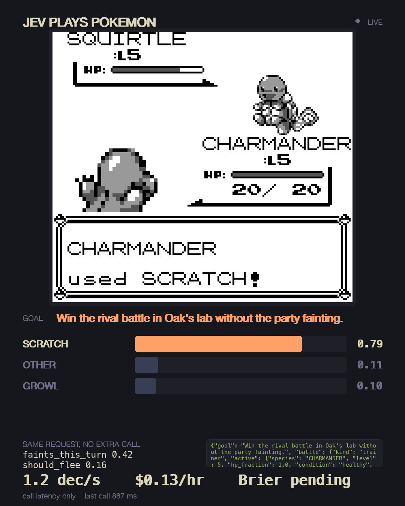
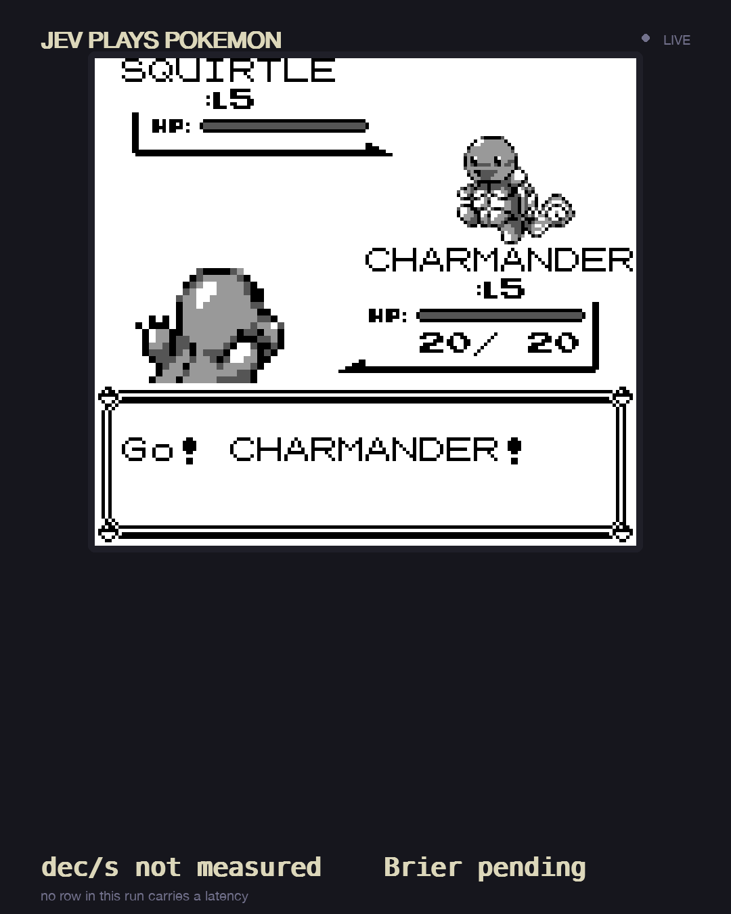

# jev-plays-pokemon-red

Pokemon Red played by a model that only outputs probabilities. Code reads the Game Boy's
memory into a typed snapshot and hands the model a menu of the moves that are actually
legal; it returns a probability for each one. The bars are those probabilities.

    uv run jpp play --rom /path/to/your/red.gb --overlay


That is a real cartridge under PyBoy, not a mockup. The agent walks out of the bedroom,
crosses Pallet Town, takes Charmander from Oak, and wins the rival battle without anyone
touching a key.

## The numbers, and what is still blank

Measured over the calls that were answered on a cartridge, through the Vercel AI Gateway
shim rather than the direct API:

```
479  496  563  679  867  1470 ms      median 621, mean 759 (n=6)
about 1.3 decisions/sec, $0.14/hour at ~725 input tokens a call
```

Calibration is **not** published yet, on purpose. The endpoint's free tier serves about
five calls per window, so the longest labelled run so far is n=5 turns with a confidence
interval that covers everything, including the constant predictor. A Brier score on that
sample would be decoration. `uv run measure` prints whatever the run actually supports, a
bad number included, and says when there is nothing to say.

## Why

Claude Plays Pokemon is a large model deliberating tens of seconds a move. This answers a
closed-set question in under a second, so the emulator is the bottleneck instead of the
model.

The catch, up front: it cannot plan. It never sees more than the current decision. Every
route, threshold and piece of arithmetic is ordinary Python, and the model only picks among
actions the code already proved legal. It is also not asked often. Code handles the routine
ticks and only calls Jev where the game actually branches. Between the bedroom and Oak's
lab it is not asked anything at all.

Here is the argument in two lines, from a real run:

```
"do you want the fire POKeMON, CHARMANDER?"   -> yes, 0.61
"give a nickname to CHARMANDER?"              -> no,  0.58
```

No fixed button survives both. Yes is wrong for the nickname and no is wrong for the
starter. The only thing separating them is the goal sentence in the state, which is the
whole reason to ask at a branch rather than script one.

Then it scores itself. Every battle turn carries a `faints_this_turn` noul, labelled from
what the RAM says happened next, and `measure` prints the Brier beside the base rate and a
constant predictor. If the model's confidence means nothing, the number says so.

<p align="center">
  
  
</p>

## Speed and cost

| | decisions/sec | $/hour | calibration published |
|---|---|---|---|
| this repo | ~1.3 (n=6, call latency, via gateway shim) | ~0.14 | not yet, sample too small |
| `milanboers/jev-plays-pokemon` | not run | not run | no |
| Claude Plays Pokemon | not published | not published | no |

Units matter more than the numbers: we ask once per branch, the incumbent asks once per
turn over eight action nouls plus a goal choice. `docs/comparison.md` has the details.

## Install

```
uv sync
cp .env.example .env
```

| variable | required | purpose |
|---|---|---|
| `POKEMON_ROM` | to play | path to your own legally obtained GB/GBC ROM |
| `TYPESAFE_API_KEY` | to call real Jev | direct API auth |
| `JEV_BASE_URL` | no | point at a gateway shim, a recording proxy, or the local fake |

Bring your own ROM. This repo contains no game data and will not help you find any. Save
states hold copyrighted memory, so they stay out of git.

## Use

```
uv run python fixtures/make_state.py red-bedroom.state    # drive the intro, headless
uv run jpp play --rom red.gb --state red-bedroom.state --headless --max-decisions 50
uv run jpp play --rom red.gb --state red-bedroom.state --frames /tmp/clip --every 2
uv run jpp probe --rom red.gb                             # watch the decoded state
uv run jpp state --ram fixtures/ram_battle.bin            # the exact request body
uv run jpp overlay --replay fixtures/runs/sample.jsonl    # the window, no ROM needed
uv run jpp overlay --replay fixtures/runs/sample.jsonl --rate 1  # normal replay pace
uv run measure runs/run.jsonl                             # the headline numbers
```

`--frames` draws the overlay over the running emulator and writes a PNG per frame, which is
how the clip above was recorded. No screen recorder, no cursor, exact length.
`demo/README.md` has the ffmpeg lines.

### Local playable MVP

The new live window gives human control immediately, without any model account:

```
uv run jpp live --rom '/path/to/your/game.gbc' --speed 1
```

Arrows move. `Z` = A, `X` = B, `Enter` = Start, `Right Shift` = Select. `-` and `+`
step through 0.25x, 0.5x, 1x, 2x, 3x, and 4x; `1` selects 1x, `2` selects 2x, and `0`
also resets to 1x. `V` toggles audio mute. `F1` reveals the shortcut panel on demand. `Ctrl-S` writes a rotating snapshot under `data/checkpoints/`, and `Ctrl-R` restores the latest one.
A checkpoint is also written when you quit normally, when a badge is earned, and about
every two minutes while you play. The resizable dashboard shows the game at its original
aspect ratio, authentic Gold 97 party front sprites when available, HP/level/held items,
an explored terrain or navigation map, battle moves and PP, and the 127-step journey with
optional side stops. Terrain is recorded only from visible overworld frames. Ambiguous story
events remain pending until you confirm them. `M` changes map views; `C` confirms the current
stage, `U` corrects a manual confirmation, and `O` marks the displayed side stop done.
The map fits the entire current area, with an Expand action for more detail. Visible NPC
sprites appear above the saved terrain; they are not baked into its history. Save and
control actions sit in the footer. The local human-play window labels Jev and Luna as
not connected rather than implying that either is streaming.
ROMs, saves, extracted artwork, and the SQLite run database stay out of git.

The live window automatically resumes the newest snapshot for the same run ID after you
close and reopen it:

```
uv run jpp live --rom '/path/to/your/game.gbc' --run-id run-001
```

`--state /path/to/file.state` chooses a specific snapshot and restores its corresponding
route and explored-map view. `--native-save` boots to the title screen so you can select
the game's own Continue option; `--new` also boots to the title without erasing the
cartridge save or snapshots. The Restart button returns to title and keeps a protected
pre-restart snapshot. Save inside the game with Start → Save; the Save help button explains
this distinction. The cartridge's battery-backed save persists when the window closes.
Older explored tiles used an incorrect coordinate scale. The first run after this update
archives that old map view and rebuilds the current map from newly observed terrain;
route completion and snapshots remain intact.
A sudden power loss can only lose work since the last periodic checkpoint; `Ctrl-S` is
the safest way to mark an exact stopping point before shutting down.

Any GB/GBC ROM works in human-control mode. Gold Reforged (`Gold 97 Reforged v6.1c.gbc`)
is detected by its cartridge species table and reports its 253-entry Pokédex, party, and
8 badges. Its starters are Chikorita, Flambear, and Cruize, not Cyndaquil, Totodile, and
the standard Gold roster. Unsupported games use generic frame/control mode; the UI never
invents maps, badges, or party data.

Run rules live in `config/game_rules.json`:

```json
{
  "player_name": "JEV",
  "starter": {
    "preferred": ["CHIKORITA", "FLAMBEAR", "CRUIZE"],
    "fallback": "first_legal"
  },
  "nickname_starter": false
}
```

Override per run with `--rules`, `--player-name`, or `--starter`. Rules select only from
legal options exposed by a game adapter. New-game name screens still require the adapter
to know that ROM's menu/RAM layout; until then, enter `JEV` manually once, and the run UI
and persisted identity remain `JEV`.

Autonomous intent providers use the native Red/Blue route controller or the adapter-
neutral button controller for Gold Reforged and other supported cartridges:

```
AGENT_PROVIDER=fake uv run jpp play --rom /path/to/your/red.gb --headless
AGENT_PROVIDER=luna_codex CODEX_MODEL=gpt-5.6-luna uv run jpp play --provider luna_codex --rom /path/to/your/red.gb --headless
AGENT_PROVIDER=luna_codex uv run jpp play --provider luna_codex --rom "/path/to/Gold 97 Reforged v6.1c.gbc" --headless
```

Sign into Codex once with `codex`; `luna_codex` calls the supported Codex CLI and falls
back to a safe legal action if CLI access is unavailable. It never reads browser tokens.

## How it works

```
PyBoy --ram bytes--> decode.py --> GameState --> goals.py (active goal)
                                       |
                                       +-> route.py (waypoints + local dodge)
                                       +-> facts.py (HP fractions, type chart, PP)
                                       +-> screen.py (what is drawn, for menus)
                                       +-> options.py (legal actions + intent text)
                                                |
                                   situation classifier
                                   |- routine  --> code presses buttons
                                   +- branch   --> policy.py --> Jev
                                                        |
                                                 overlay.py + runs/*.jsonl
```

| goal | done when |
|---|---|
| `leave_house` | `wCurMap` is neither house map |
| `get_starter` | `wPartyCount >= 1` and `EVENT_GOT_STARTER` |
| `win_lab_rival` | `EVENT_BATTLED_RIVAL_IN_OAKS_LAB`, and the latched `wBattleResult` is a win |
| `reach_viridian` | `wCurMap == $01` |

Addresses come from walking pret/pokered's `ram/wram.asm` from the WRAM0 origin and summing
the struct macros, not from copying hex. Nine of them match independently published values
byte for byte, which is what makes the rest of the table trustworthy.

### What the cartridge changed

Nothing here was caught by tests over synthetic RAM, because the fakes are too tidy:

- `wTextBoxID` is not "a text box is open". It holds the last box's id and never clears, so
  from the intro onward it reads 1 and the agent pressed A forever. `wFontLoaded` is the
  byte that tracks it, and battle text does not set that one either, so a battle branch has
  to wait for `wBattleMon` to be populated instead.
- A walking step takes longer than one tick, so judging a step immediately read every
  successful move as a wall and retired the axis.
- `wMaxMenuItem` keeps the name list's 3 from the intro forever. No menu flag in RAM can be
  trusted, which is why `screen.py` reads `wTileMap` and believes the words on screen.
- The rival does not challenge on the spot; he intercepts on the way out of the lab.

## Known limits

- One turn of lookahead. No strategy, no team building.
- v0.1 targets Viridian City on a hardcoded route. Pallet Town's exit is measured and
  works; Route 1 still walks into a ledge at `(10, 28)` and stops. One waypoint per map
  cannot express a way around it, so that is the v0.2 occupancy map, not another
  hand-picked tile.
- Without Jev the code default loses the rival battle, so `win_lab_rival` never completes
  and nothing downstream of it runs.
- The RAM fixtures are synthetic, so the unit tests cannot catch a wrong address. The ROM
  smoke test is what catches that, and it only runs locally.
- Brier is on per-turn fainting. At v0.1's length and the current rate limit it is
  preliminary, not a published calibration claim.
- `fixtures/runs/sample.jsonl` is a fixture, not a playthrough: synthetic RAM, no emulator,
  20 of its 40 rows real answers and the rest deterministic stand-ins tagged
  `"source": "fake"`. `measure` excludes those and says how many there were. The overlay
  refuses to draw them at all unless asked.
- decisions/sec is call latency only. Playback pacing and rate-limit retries are kept out
  of it, so `--demo` can never print itself as a measurement.

## Development

```
uv run pytest -q
uv run python fixtures/make_ram.py      # regenerate the synthetic RAM fixtures
```

Tests run offline against `fixtures/fake_jev.py` and the recorded answers in
`fixtures/recorded/`. No key, no network, no ROM.

The ROM tests skip unless you point them at a cartridge:

```
POKEMON_ROM=/path/to/red.gb uv run pytest tests/test_smoke_rom.py -q
POKEMON_ROM=/path/to/red.gb uv run python fixtures/make_state.py red-bedroom.state
POKEMON_STATE=$PWD/red-bedroom.state POKEMON_ROM=/path/to/red.gb uv run pytest -q
```

`make_state.py` drives the new-game intro headless, which the smoke test used to need a
human for. `probe` walks the route by hand while printing the decoded state, which is how
the waypoints and the input-readiness predicate were settled.

## License

MIT.
